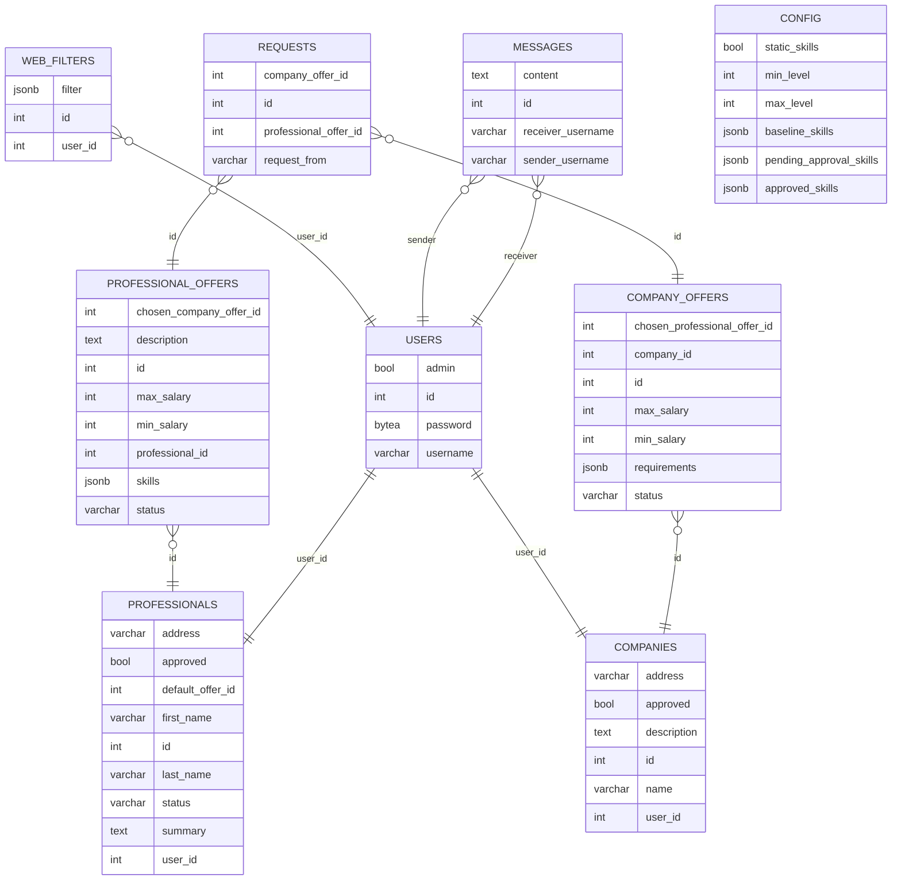

# Job Utopia

Work in progress

## Run Locally

Currently the recommended way to setup locally is via Docker

Install and run Docker

Clone the project

```bash
git clone https://github.com/Team7-FinalWebProject/JobMatch
```
Go to the project directory
```bash
cd JobMatch
```

Register and setup accounts at OpenAPI and Mailjet.
Save the API keys and prepare other details to fill in

 - Mailjet sender e-mail, API_secret
 - user password for the jobmatch admin and initial users
 - db password (same password in several files)
 - JWT_Secret for login security

Fill the details in the template configuration files identified with ".sample" extension and rename the files.
```bash
Windows: rename file.extension.sample file.extension
Linux: mv file.extension.sample file.extension
```
Start the containers (with Docker compose)
```bash
docker-compose up -d --build
```

## Hosting:

Project is currently hosted here:
[Fronted -> Vercel](https://jobutopia.vercel.app/)
[Backend -> Heroku (Swagger API docs)](https://jobutopia-82f9ec412313.herokuapp.com/docs)
[DB -> Supabase (private)](https://supabase.com/)


## Database:
PostgreSQL




> Written with [StackEdit](https://stackedit.io/).