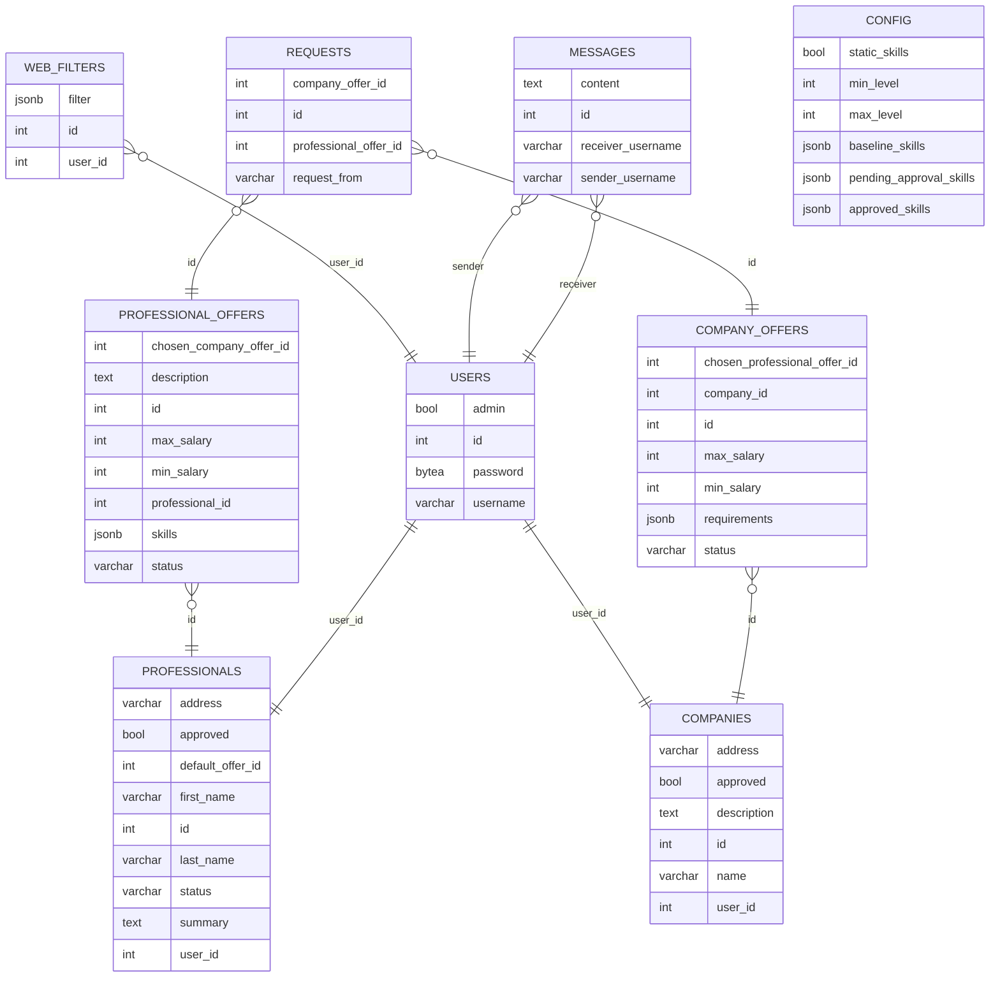

# Job Utopia

Work in progress

## Run Locally

Currently the recommended way to setup locally is via Docker

Install and run Docker

Clone the project

```bash
git clone https://github.com/Team7-FinalWebProject/JobMatch
```
Go to the project directory
```bash
cd JobMatch
```

Register and setup accounts at OpenAPI and Mailjet.
Save the API keys and prepare other details to fill in

 - Mailjet sender e-mail, API_secret
 - user password for the jobmatch admin and initial users
 - db password (same password in several files)
 - JWT_Secret for login security

Fill the details in the template configuration files identified with ".sample" extension and rename the files.
```bash
Windows: rename file.extension.sample file.extension
Linux: mv file.extension.sample file.extension
```
Start the containers (with Docker compose)
```bash
docker-compose up -d --build
```

## Hosting:

Project is currently hosted here:
[Fronted -> Vercel](https://jobutopia.vercel.app/)
[Backend -> Heroku (Swagger API docs)](https://jobutopia-82f9ec412313.herokuapp.com/docs)
[DB -> Supabase (private)](https://supabase.com/)


## Database:
PostgreSQL

<pre class=" language-mermaid"><svg id="mermaid-svg-qpVtInS1C6DH8Z1l" width="100%" xmlns="http://www.w3.org/2000/svg" height="812.727294921875" style="max-width: 918.76416015625px;" viewBox="0 0 918.76416015625 812.727294921875"><style>#mermaid-svg-qpVtInS1C6DH8Z1l{font-family:"trebuchet ms",verdana,arial,sans-serif;font-size:16px;fill:#000000;}#mermaid-svg-qpVtInS1C6DH8Z1l .error-icon{fill:#552222;}#mermaid-svg-qpVtInS1C6DH8Z1l .error-text{fill:#552222;stroke:#552222;}#mermaid-svg-qpVtInS1C6DH8Z1l .edge-thickness-normal{stroke-width:2px;}#mermaid-svg-qpVtInS1C6DH8Z1l .edge-thickness-thick{stroke-width:3.5px;}#mermaid-svg-qpVtInS1C6DH8Z1l .edge-pattern-solid{stroke-dasharray:0;}#mermaid-svg-qpVtInS1C6DH8Z1l .edge-pattern-dashed{stroke-dasharray:3;}#mermaid-svg-qpVtInS1C6DH8Z1l .edge-pattern-dotted{stroke-dasharray:2;}#mermaid-svg-qpVtInS1C6DH8Z1l .marker{fill:#666;stroke:#666;}#mermaid-svg-qpVtInS1C6DH8Z1l .marker.cross{stroke:#666;}#mermaid-svg-qpVtInS1C6DH8Z1l svg{font-family:"trebuchet ms",verdana,arial,sans-serif;font-size:16px;}#mermaid-svg-qpVtInS1C6DH8Z1l .entityBox{fill:#eee;stroke:#999;}#mermaid-svg-qpVtInS1C6DH8Z1l .attributeBoxOdd{fill:#ffffff;stroke:#999;}#mermaid-svg-qpVtInS1C6DH8Z1l .attributeBoxEven{fill:#f2f2f2;stroke:#999;}#mermaid-svg-qpVtInS1C6DH8Z1l .relationshipLabelBox{fill:hsl(-160,0%,93.3333333333%);opacity:0.7;background-color:hsl(-160,0%,93.3333333333%);}#mermaid-svg-qpVtInS1C6DH8Z1l .relationshipLabelBox rect{opacity:0.5;}#mermaid-svg-qpVtInS1C6DH8Z1l .relationshipLine{stroke:#666;}#mermaid-svg-qpVtInS1C6DH8Z1l:root{--mermaid-font-family:"trebuchet ms",verdana,arial,sans-serif;}#mermaid-svg-qpVtInS1C6DH8Z1l er{fill:apa;}</style><g></g><defs><marker id="ONLY_ONE_START" refX="0" refY="9" markerWidth="18" markerHeight="18" orient="auto"><path stroke="gray" fill="none" d="M9,0 L9,18 M15,0 L15,18"></path></marker></defs><defs><marker id="ONLY_ONE_END" refX="18" refY="9" markerWidth="18" markerHeight="18" orient="auto"><path stroke="gray" fill="none" d="M3,0 L3,18 M9,0 L9,18"></path></marker></defs><defs><marker id="ZERO_OR_ONE_START" refX="0" refY="9" markerWidth="30" markerHeight="18" orient="auto"><circle stroke="gray" fill="white" cx="21" cy="9" r="6"></circle><path stroke="gray" fill="none" d="M9,0 L9,18"></path></marker></defs><defs><marker id="ZERO_OR_ONE_END" refX="30" refY="9" markerWidth="30" markerHeight="18" orient="auto"><circle stroke="gray" fill="white" cx="9" cy="9" r="6"></circle><path stroke="gray" fill="none" d="M21,0 L21,18"></path></marker></defs><defs><marker id="ONE_OR_MORE_START" refX="18" refY="18" markerWidth="45" markerHeight="36" orient="auto"><path stroke="gray" fill="none" d="M0,18 Q 18,0 36,18 Q 18,36 0,18 M42,9 L42,27"></path></marker></defs><defs><marker id="ONE_OR_MORE_END" refX="27" refY="18" markerWidth="45" markerHeight="36" orient="auto"><path stroke="gray" fill="none" d="M3,9 L3,27 M9,18 Q27,0 45,18 Q27,36 9,18"></path></marker></defs><defs><marker id="ZERO_OR_MORE_START" refX="18" refY="18" markerWidth="57" markerHeight="36" orient="auto"><circle stroke="gray" fill="white" cx="48" cy="18" r="6"></circle><path stroke="gray" fill="none" d="M0,18 Q18,0 36,18 Q18,36 0,18"></path></marker></defs><defs><marker id="ZERO_OR_MORE_END" refX="39" refY="18" markerWidth="57" markerHeight="36" orient="auto"><circle stroke="gray" fill="white" cx="9" cy="18" r="6"></circle><path stroke="gray" fill="none" d="M21,18 Q39,0 57,18 Q39,36 21,18"></path></marker></defs><path class="er relationshipLine" d="M121.87812042236328,120.2330202752144L160.44889418284097,137.61842621811488C199.0196679433187,155.00383216101534,276.1612154642741,189.77464404681623,325.19946885274413,222.7661100177929C374.2377222412142,255.75757598876953,395.172681497199,286.9696960449219,405.64016112519136,302.57575607299805L416.1076407531838,318.1818161010742" stroke="gray" fill="none" marker-end="url(#ONLY_ONE_END)" marker-start="url(#ZERO_OR_MORE_START)"></path><path class="er relationshipLine" d="M184.56625938415527,472.7272644042969L184.56625938415527,481.0605977376302C184.56625938415527,489.39393107096356,184.56625938415527,506.0605977376302,185.92689951260886,522.7272644042969C187.2875396410624,539.3939310709635,190.00881989796957,556.0605977376302,191.36946002642313,564.3939310709635L192.7301001548767,572.7272644042969" stroke="gray" fill="none" marker-end="url(#ONLY_ONE_END)" marker-start="url(#ZERO_OR_MORE_START)"></path><path class="er relationshipLine" d="M263.4260303927541,152.7272720336914L250.2827352246543,164.69696935017905C237.1394400565545,176.66666666666666,210.8528497203549,200.60606129964194,197.70955455225507,220.9090919494629C184.56625938415527,241.21212259928384,184.56625938415527,257.8787892659505,184.56625938415527,266.2121225992839L184.56625938415527,274.5454559326172" stroke="gray" fill="none" marker-end="url(#ONLY_ONE_END)" marker-start="url(#ZERO_OR_MORE_START)"></path><path class="er relationshipLine" d="M416.1076407531838,429.09090423583984L405.64016112519136,444.696964263916C395.172681497199,460.3030242919922,374.2377222412142,491.51514434814453,350.88482594655517,521.5776567469475C327.5319296518962,551.6401691457503,301.7610963185628,580.5530738872038,288.8756796518962,595.0095262579306L275.9902629852295,609.4659786286572" stroke="gray" fill="none" marker-end="url(#ONLY_ONE_END)" marker-start="url(#ONLY_ONE_START)"></path><path class="er relationshipLine" d="M490.4978852172752,429.09090423583984L500.96536484526763,444.696964263916C511.43284447326,460.3030242919922,532.3678037292448,491.51514434814453,549.0685941597736,520.9090830485026C565.7693845903024,550.3030217488607,578.2360061953752,577.8787790934244,584.4693169979117,591.6666577657064L590.7026278004481,605.4545364379883" stroke="gray" fill="none" marker-end="url(#ONLY_ONE_END)" marker-start="url(#ONLY_ONE_START)"></path><path class="er relationshipLine" d="M725.636568069458,461.81817626953125L725.636568069458,471.9696909586589C725.636568069458,482.12120564778644,725.636568069458,502.4242350260417,717.0191438992819,526.3636283874512C708.4017197291056,550.3030217488607,691.1668713887533,577.8787790934244,682.549447218577,591.6666577657064L673.9320230484009,605.4545364379883" stroke="gray" fill="none" marker-end="url(#ONLY_ONE_END)" marker-start="url(#ZERO_OR_MORE_START)"></path><path class="er relationshipLine" d="M400.6330871582031,121.4750848185774L454.8003339767456,138.6534800042507C508.9675807952881,155.83187518992398,617.302074432373,190.1886655612706,671.4693212509155,217.5185754360715C725.636568069458,244.8484853108724,725.636568069458,265.1515146891276,725.636568069458,275.3030293782552L725.636568069458,285.4545440673828" stroke="gray" fill="none" marker-end="url(#ONLY_ONE_END)" marker-start="url(#ZERO_OR_MORE_START)"></path><path class="er relationshipLine" d="M520.3209502998408,152.7272720336914L509.1512524140722,164.69696935017905C497.98155452830366,176.66666666666666,475.64215875676655,200.60606129964194,464.472460870998,228.18181864420572C453.3027629852295,255.75757598876953,453.3027629852295,286.9696960449219,453.3027629852295,302.57575607299805L453.3027629852295,318.1818161010742" stroke="gray" fill="none" marker-end="url(#ONLY_ONE_END)" marker-start="url(#ZERO_OR_MORE_START)"></path><path class="er relationshipLine" d="M563.8923775439105,152.7272720336914L562.1274417841304,164.69696935017905C560.3625060243502,176.66666666666666,556.8326345047898,200.60606129964194,544.6002191170173,228.18181864420572C532.3678037292448,255.75757598876953,511.43284447326,286.9696960449219,500.96536484526763,302.57575607299805L490.4978852172752,318.1818161010742" stroke="gray" fill="none" marker-end="url(#ONLY_ONE_END)" marker-start="url(#ZERO_OR_MORE_START)"></path><g id="WEB_FILTERS" transform="translate(20,52.72727584838867 )"><rect class="er entityBox" fill="honeydew" fill-opacity="100%" stroke="gray" x="0" y="0" width="101.87812042236328" height="89.09090614318848"></rect><text class="er entityLabel" id="entity-WEB_FILTERS" x="0" y="0" dominant-baseline="middle" text-anchor="middle" style="font-family: &quot;trebuchet ms&quot;, verdana, arial, sans-serif;; font-size: 12px" transform="translate(50.93906021118164,11.81818151473999)">WEB_FILTERS</text><rect class="er attributeBoxOdd" fill="honeydew" fill-opacity="100%" stroke="gray" x="0" y="23.63636302947998" width="47.44241237640381" height="21.818181037902832"></rect><text class="er entityLabel" id="entity-WEB_FILTERS-attr-1-type" x="0" y="0" dominant-baseline="middle" text-anchor="left" style="font-family: &quot;trebuchet ms&quot;, verdana, arial, sans-serif;; font-size: 10.2px" transform="translate(5,34.5454535484314)">jsonb</text><rect class="er attributeBoxOdd" fill="honeydew" fill-opacity="100%" stroke="gray" x="047.44241237640381" y="23.63636302947998" width="54.43570804595947" height="21.818181037902832"></rect><text class="er entityLabel" id="entity-WEB_FILTERS-attr-1-name" x="0" y="0" dominant-baseline="middle" text-anchor="left" style="font-family: &quot;trebuchet ms&quot;, verdana, arial, sans-serif;; font-size: 10.2px" transform="translate(52.44241237640381,34.5454535484314)">filter</text><rect class="er attributeBoxEven" fill="honeydew" fill-opacity="100%" stroke="gray" x="0" y="45.45454406738281" width="47.44241237640381" height="21.818181037902832"></rect><text class="er entityLabel" id="entity-WEB_FILTERS-attr-2-type" x="0" y="0" dominant-baseline="middle" text-anchor="left" style="font-family: &quot;trebuchet ms&quot;, verdana, arial, sans-serif;; font-size: 10.2px" transform="translate(5,56.36363458633423)">int</text><rect class="er attributeBoxEven" fill="honeydew" fill-opacity="100%" stroke="gray" x="047.44241237640381" y="45.45454406738281" width="54.43570804595947" height="21.818181037902832"></rect><text class="er entityLabel" id="entity-WEB_FILTERS-attr-2-name" x="0" y="0" dominant-baseline="middle" text-anchor="left" style="font-family: &quot;trebuchet ms&quot;, verdana, arial, sans-serif;; font-size: 10.2px" transform="translate(52.44241237640381,56.36363458633423)">id</text><rect class="er attributeBoxOdd" fill="honeydew" fill-opacity="100%" stroke="gray" x="0" y="67.27272510528564" width="47.44241237640381" height="21.818181037902832"></rect><text class="er entityLabel" id="entity-WEB_FILTERS-attr-3-type" x="0" y="0" dominant-baseline="middle" text-anchor="left" style="font-family: &quot;trebuchet ms&quot;, verdana, arial, sans-serif;; font-size: 10.2px" transform="translate(5,78.18181562423706)">int</text><rect class="er attributeBoxOdd" fill="honeydew" fill-opacity="100%" stroke="gray" x="047.44241237640381" y="67.27272510528564" width="54.43570804595947" height="21.818181037902832"></rect><text class="er entityLabel" id="entity-WEB_FILTERS-attr-3-name" x="0" y="0" dominant-baseline="middle" text-anchor="left" style="font-family: &quot;trebuchet ms&quot;, verdana, arial, sans-serif;; font-size: 10.2px" transform="translate(52.44241237640381,78.18181562423706)">user_id</text></g><g id="USERS" transform="translate(403.3027629852295,318.1818161010742 )"><rect class="er entityBox" fill="honeydew" fill-opacity="100%" stroke="gray" x="0" y="0" width="100" height="110.90908718109131"></rect><text class="er entityLabel" id="entity-USERS" x="0" y="0" dominant-baseline="middle" text-anchor="middle" style="font-family: &quot;trebuchet ms&quot;, verdana, arial, sans-serif;; font-size: 12px" transform="translate(50,11.81818151473999)">USERS</text><rect class="er attributeBoxOdd" fill="honeydew" fill-opacity="100%" stroke="gray" x="0" y="23.63636302947998" width="45.775569915771484" height="21.818181037902832"></rect><text class="er entityLabel" id="entity-USERS-attr-1-type" x="0" y="0" dominant-baseline="middle" text-anchor="left" style="font-family: &quot;trebuchet ms&quot;, verdana, arial, sans-serif;; font-size: 10.2px" transform="translate(5,34.5454535484314)">bool</text><rect class="er attributeBoxOdd" fill="honeydew" fill-opacity="100%" stroke="gray" x="045.775569915771484" y="23.63636302947998" width="54.224430084228516" height="21.818181037902832"></rect><text class="er entityLabel" id="entity-USERS-attr-1-name" x="0" y="0" dominant-baseline="middle" text-anchor="left" style="font-family: &quot;trebuchet ms&quot;, verdana, arial, sans-serif;; font-size: 10.2px" transform="translate(50.775569915771484,34.5454535484314)">admin</text><rect class="er attributeBoxEven" fill="honeydew" fill-opacity="100%" stroke="gray" x="0" y="45.45454406738281" width="45.775569915771484" height="21.818181037902832"></rect><text class="er entityLabel" id="entity-USERS-attr-2-type" x="0" y="0" dominant-baseline="middle" text-anchor="left" style="font-family: &quot;trebuchet ms&quot;, verdana, arial, sans-serif;; font-size: 10.2px" transform="translate(5,56.36363458633423)">int</text><rect class="er attributeBoxEven" fill="honeydew" fill-opacity="100%" stroke="gray" x="045.775569915771484" y="45.45454406738281" width="54.224430084228516" height="21.818181037902832"></rect><text class="er entityLabel" id="entity-USERS-attr-2-name" x="0" y="0" dominant-baseline="middle" text-anchor="left" style="font-family: &quot;trebuchet ms&quot;, verdana, arial, sans-serif;; font-size: 10.2px" transform="translate(50.775569915771484,56.36363458633423)">id</text><rect class="er attributeBoxOdd" fill="honeydew" fill-opacity="100%" stroke="gray" x="0" y="67.27272510528564" width="45.775569915771484" height="21.818181037902832"></rect><text class="er entityLabel" id="entity-USERS-attr-3-type" x="0" y="0" dominant-baseline="middle" text-anchor="left" style="font-family: &quot;trebuchet ms&quot;, verdana, arial, sans-serif;; font-size: 10.2px" transform="translate(5,78.18181562423706)">bytea</text><rect class="er attributeBoxOdd" fill="honeydew" fill-opacity="100%" stroke="gray" x="045.775569915771484" y="67.27272510528564" width="54.224430084228516" height="21.818181037902832"></rect><text class="er entityLabel" id="entity-USERS-attr-3-name" x="0" y="0" dominant-baseline="middle" text-anchor="left" style="font-family: &quot;trebuchet ms&quot;, verdana, arial, sans-serif;; font-size: 10.2px" transform="translate(50.775569915771484,78.18181562423706)">password</text><rect class="er attributeBoxEven" fill="honeydew" fill-opacity="100%" stroke="gray" x="0" y="89.09090614318848" width="45.775569915771484" height="21.818181037902832"></rect><text class="er entityLabel" id="entity-USERS-attr-4-type" x="0" y="0" dominant-baseline="middle" text-anchor="left" style="font-family: &quot;trebuchet ms&quot;, verdana, arial, sans-serif;; font-size: 10.2px" transform="translate(5,99.99999666213989)">varchar</text><rect class="er attributeBoxEven" fill="honeydew" fill-opacity="100%" stroke="gray" x="045.775569915771484" y="89.09090614318848" width="54.224430084228516" height="21.818181037902832"></rect><text class="er entityLabel" id="entity-USERS-attr-4-name" x="0" y="0" dominant-baseline="middle" text-anchor="left" style="font-family: &quot;trebuchet ms&quot;, verdana, arial, sans-serif;; font-size: 10.2px" transform="translate(50.775569915771484,99.99999666213989)">username</text></g><g id="PROFESSIONAL_OFFERS" transform="translate(97.09325218200684,274.5454559326172 )"><rect class="er entityBox" fill="honeydew" fill-opacity="100%" stroke="gray" x="0" y="0" width="174.9460220336914" height="198.18181133270264"></rect><text class="er entityLabel" id="entity-PROFESSIONAL_OFFERS" x="0" y="0" dominant-baseline="middle" text-anchor="middle" style="font-family: &quot;trebuchet ms&quot;, verdana, arial, sans-serif;; font-size: 12px" transform="translate(87.4730110168457,11.81818151473999)">PROFESSIONAL_OFFERS</text><rect class="er attributeBoxOdd" fill="honeydew" fill-opacity="100%" stroke="gray" x="0" y="23.63636302947998" width="45.75568389892578" height="21.818181037902832"></rect><text class="er entityLabel" id="entity-PROFESSIONAL_OFFERS-attr-1-type" x="0" y="0" dominant-baseline="middle" text-anchor="left" style="font-family: &quot;trebuchet ms&quot;, verdana, arial, sans-serif;; font-size: 10.2px" transform="translate(5,34.5454535484314)">int</text><rect class="er attributeBoxOdd" fill="honeydew" fill-opacity="100%" stroke="gray" x="045.75568389892578" y="23.63636302947998" width="129.19033813476562" height="21.818181037902832"></rect><text class="er entityLabel" id="entity-PROFESSIONAL_OFFERS-attr-1-name" x="0" y="0" dominant-baseline="middle" text-anchor="left" style="font-family: &quot;trebuchet ms&quot;, verdana, arial, sans-serif;; font-size: 10.2px" transform="translate(50.75568389892578,34.5454535484314)">chosen_company_offer_id</text><rect class="er attributeBoxEven" fill="honeydew" fill-opacity="100%" stroke="gray" x="0" y="45.45454406738281" width="45.75568389892578" height="21.818181037902832"></rect><text class="er entityLabel" id="entity-PROFESSIONAL_OFFERS-attr-2-type" x="0" y="0" dominant-baseline="middle" text-anchor="left" style="font-family: &quot;trebuchet ms&quot;, verdana, arial, sans-serif;; font-size: 10.2px" transform="translate(5,56.36363458633423)">text</text><rect class="er attributeBoxEven" fill="honeydew" fill-opacity="100%" stroke="gray" x="045.75568389892578" y="45.45454406738281" width="129.19033813476562" height="21.818181037902832"></rect><text class="er entityLabel" id="entity-PROFESSIONAL_OFFERS-attr-2-name" x="0" y="0" dominant-baseline="middle" text-anchor="left" style="font-family: &quot;trebuchet ms&quot;, verdana, arial, sans-serif;; font-size: 10.2px" transform="translate(50.75568389892578,56.36363458633423)">description</text><rect class="er attributeBoxOdd" fill="honeydew" fill-opacity="100%" stroke="gray" x="0" y="67.27272510528564" width="45.75568389892578" height="21.818181037902832"></rect><text class="er entityLabel" id="entity-PROFESSIONAL_OFFERS-attr-3-type" x="0" y="0" dominant-baseline="middle" text-anchor="left" style="font-family: &quot;trebuchet ms&quot;, verdana, arial, sans-serif;; font-size: 10.2px" transform="translate(5,78.18181562423706)">int</text><rect class="er attributeBoxOdd" fill="honeydew" fill-opacity="100%" stroke="gray" x="045.75568389892578" y="67.27272510528564" width="129.19033813476562" height="21.818181037902832"></rect><text class="er entityLabel" id="entity-PROFESSIONAL_OFFERS-attr-3-name" x="0" y="0" dominant-baseline="middle" text-anchor="left" style="font-family: &quot;trebuchet ms&quot;, verdana, arial, sans-serif;; font-size: 10.2px" transform="translate(50.75568389892578,78.18181562423706)">id</text><rect class="er attributeBoxEven" fill="honeydew" fill-opacity="100%" stroke="gray" x="0" y="89.09090614318848" width="45.75568389892578" height="21.818181037902832"></rect><text class="er entityLabel" id="entity-PROFESSIONAL_OFFERS-attr-4-type" x="0" y="0" dominant-baseline="middle" text-anchor="left" style="font-family: &quot;trebuchet ms&quot;, verdana, arial, sans-serif;; font-size: 10.2px" transform="translate(5,99.99999666213989)">int</text><rect class="er attributeBoxEven" fill="honeydew" fill-opacity="100%" stroke="gray" x="045.75568389892578" y="89.09090614318848" width="129.19033813476562" height="21.818181037902832"></rect><text class="er entityLabel" id="entity-PROFESSIONAL_OFFERS-attr-4-name" x="0" y="0" dominant-baseline="middle" text-anchor="left" style="font-family: &quot;trebuchet ms&quot;, verdana, arial, sans-serif;; font-size: 10.2px" transform="translate(50.75568389892578,99.99999666213989)">max_salary</text><rect class="er attributeBoxOdd" fill="honeydew" fill-opacity="100%" stroke="gray" x="0" y="110.90908718109131" width="45.75568389892578" height="21.818181037902832"></rect><text class="er entityLabel" id="entity-PROFESSIONAL_OFFERS-attr-5-type" x="0" y="0" dominant-baseline="middle" text-anchor="left" style="font-family: &quot;trebuchet ms&quot;, verdana, arial, sans-serif;; font-size: 10.2px" transform="translate(5,121.81817770004272)">int</text><rect class="er attributeBoxOdd" fill="honeydew" fill-opacity="100%" stroke="gray" x="045.75568389892578" y="110.90908718109131" width="129.19033813476562" height="21.818181037902832"></rect><text class="er entityLabel" id="entity-PROFESSIONAL_OFFERS-attr-5-name" x="0" y="0" dominant-baseline="middle" text-anchor="left" style="font-family: &quot;trebuchet ms&quot;, verdana, arial, sans-serif;; font-size: 10.2px" transform="translate(50.75568389892578,121.81817770004272)">min_salary</text><rect class="er attributeBoxEven" fill="honeydew" fill-opacity="100%" stroke="gray" x="0" y="132.72726821899414" width="45.75568389892578" height="21.818181037902832"></rect><text class="er entityLabel" id="entity-PROFESSIONAL_OFFERS-attr-6-type" x="0" y="0" dominant-baseline="middle" text-anchor="left" style="font-family: &quot;trebuchet ms&quot;, verdana, arial, sans-serif;; font-size: 10.2px" transform="translate(5,143.63635873794556)">int</text><rect class="er attributeBoxEven" fill="honeydew" fill-opacity="100%" stroke="gray" x="045.75568389892578" y="132.72726821899414" width="129.19033813476562" height="21.818181037902832"></rect><text class="er entityLabel" id="entity-PROFESSIONAL_OFFERS-attr-6-name" x="0" y="0" dominant-baseline="middle" text-anchor="left" style="font-family: &quot;trebuchet ms&quot;, verdana, arial, sans-serif;; font-size: 10.2px" transform="translate(50.75568389892578,143.63635873794556)">professional_id</text><rect class="er attributeBoxOdd" fill="honeydew" fill-opacity="100%" stroke="gray" x="0" y="154.54544925689697" width="45.75568389892578" height="21.818181037902832"></rect><text class="er entityLabel" id="entity-PROFESSIONAL_OFFERS-attr-7-type" x="0" y="0" dominant-baseline="middle" text-anchor="left" style="font-family: &quot;trebuchet ms&quot;, verdana, arial, sans-serif;; font-size: 10.2px" transform="translate(5,165.4545397758484)">jsonb</text><rect class="er attributeBoxOdd" fill="honeydew" fill-opacity="100%" stroke="gray" x="045.75568389892578" y="154.54544925689697" width="129.19033813476562" height="21.818181037902832"></rect><text class="er entityLabel" id="entity-PROFESSIONAL_OFFERS-attr-7-name" x="0" y="0" dominant-baseline="middle" text-anchor="left" style="font-family: &quot;trebuchet ms&quot;, verdana, arial, sans-serif;; font-size: 10.2px" transform="translate(50.75568389892578,165.4545397758484)">skills</text><rect class="er attributeBoxEven" fill="honeydew" fill-opacity="100%" stroke="gray" x="0" y="176.3636302947998" width="45.75568389892578" height="21.818181037902832"></rect><text class="er entityLabel" id="entity-PROFESSIONAL_OFFERS-attr-8-type" x="0" y="0" dominant-baseline="middle" text-anchor="left" style="font-family: &quot;trebuchet ms&quot;, verdana, arial, sans-serif;; font-size: 10.2px" transform="translate(5,187.27272081375122)">varchar</text><rect class="er attributeBoxEven" fill="honeydew" fill-opacity="100%" stroke="gray" x="045.75568389892578" y="176.3636302947998" width="129.19033813476562" height="21.818181037902832"></rect><text class="er entityLabel" id="entity-PROFESSIONAL_OFFERS-attr-8-name" x="0" y="0" dominant-baseline="middle" text-anchor="left" style="font-family: &quot;trebuchet ms&quot;, verdana, arial, sans-serif;; font-size: 10.2px" transform="translate(50.75568389892578,187.27272081375122)">status</text></g><g id="PROFESSIONALS" transform="translate(145.39083671569824,572.7272644042969 )"><rect class="er entityBox" fill="honeydew" fill-opacity="100%" stroke="gray" x="0" y="0" width="130.59943389892578" height="219.99999237060547"></rect><text class="er entityLabel" id="entity-PROFESSIONALS" x="0" y="0" dominant-baseline="middle" text-anchor="middle" style="font-family: &quot;trebuchet ms&quot;, verdana, arial, sans-serif;; font-size: 12px" transform="translate(65.29971694946289,11.81818151473999)">PROFESSIONALS</text><rect class="er attributeBoxOdd" fill="honeydew" fill-opacity="100%" stroke="gray" x="0" y="23.63636302947998" width="45.75568389892578" height="21.818181037902832"></rect><text class="er entityLabel" id="entity-PROFESSIONALS-attr-1-type" x="0" y="0" dominant-baseline="middle" text-anchor="left" style="font-family: &quot;trebuchet ms&quot;, verdana, arial, sans-serif;; font-size: 10.2px" transform="translate(5,34.5454535484314)">varchar</text><rect class="er attributeBoxOdd" fill="honeydew" fill-opacity="100%" stroke="gray" x="045.75568389892578" y="23.63636302947998" width="84.84375" height="21.818181037902832"></rect><text class="er entityLabel" id="entity-PROFESSIONALS-attr-1-name" x="0" y="0" dominant-baseline="middle" text-anchor="left" style="font-family: &quot;trebuchet ms&quot;, verdana, arial, sans-serif;; font-size: 10.2px" transform="translate(50.75568389892578,34.5454535484314)">address</text><rect class="er attributeBoxEven" fill="honeydew" fill-opacity="100%" stroke="gray" x="0" y="45.45454406738281" width="45.75568389892578" height="21.818181037902832"></rect><text class="er entityLabel" id="entity-PROFESSIONALS-attr-2-type" x="0" y="0" dominant-baseline="middle" text-anchor="left" style="font-family: &quot;trebuchet ms&quot;, verdana, arial, sans-serif;; font-size: 10.2px" transform="translate(5,56.36363458633423)">bool</text><rect class="er attributeBoxEven" fill="honeydew" fill-opacity="100%" stroke="gray" x="045.75568389892578" y="45.45454406738281" width="84.84375" height="21.818181037902832"></rect><text class="er entityLabel" id="entity-PROFESSIONALS-attr-2-name" x="0" y="0" dominant-baseline="middle" text-anchor="left" style="font-family: &quot;trebuchet ms&quot;, verdana, arial, sans-serif;; font-size: 10.2px" transform="translate(50.75568389892578,56.36363458633423)">approved</text><rect class="er attributeBoxOdd" fill="honeydew" fill-opacity="100%" stroke="gray" x="0" y="67.27272510528564" width="45.75568389892578" height="21.818181037902832"></rect><text class="er entityLabel" id="entity-PROFESSIONALS-attr-3-type" x="0" y="0" dominant-baseline="middle" text-anchor="left" style="font-family: &quot;trebuchet ms&quot;, verdana, arial, sans-serif;; font-size: 10.2px" transform="translate(5,78.18181562423706)">int</text><rect class="er attributeBoxOdd" fill="honeydew" fill-opacity="100%" stroke="gray" x="045.75568389892578" y="67.27272510528564" width="84.84375" height="21.818181037902832"></rect><text class="er entityLabel" id="entity-PROFESSIONALS-attr-3-name" x="0" y="0" dominant-baseline="middle" text-anchor="left" style="font-family: &quot;trebuchet ms&quot;, verdana, arial, sans-serif;; font-size: 10.2px" transform="translate(50.75568389892578,78.18181562423706)">default_offer_id</text><rect class="er attributeBoxEven" fill="honeydew" fill-opacity="100%" stroke="gray" x="0" y="89.09090614318848" width="45.75568389892578" height="21.818181037902832"></rect><text class="er entityLabel" id="entity-PROFESSIONALS-attr-4-type" x="0" y="0" dominant-baseline="middle" text-anchor="left" style="font-family: &quot;trebuchet ms&quot;, verdana, arial, sans-serif;; font-size: 10.2px" transform="translate(5,99.99999666213989)">varchar</text><rect class="er attributeBoxEven" fill="honeydew" fill-opacity="100%" stroke="gray" x="045.75568389892578" y="89.09090614318848" width="84.84375" height="21.818181037902832"></rect><text class="er entityLabel" id="entity-PROFESSIONALS-attr-4-name" x="0" y="0" dominant-baseline="middle" text-anchor="left" style="font-family: &quot;trebuchet ms&quot;, verdana, arial, sans-serif;; font-size: 10.2px" transform="translate(50.75568389892578,99.99999666213989)">first_name</text><rect class="er attributeBoxOdd" fill="honeydew" fill-opacity="100%" stroke="gray" x="0" y="110.90908718109131" width="45.75568389892578" height="21.818181037902832"></rect><text class="er entityLabel" id="entity-PROFESSIONALS-attr-5-type" x="0" y="0" dominant-baseline="middle" text-anchor="left" style="font-family: &quot;trebuchet ms&quot;, verdana, arial, sans-serif;; font-size: 10.2px" transform="translate(5,121.81817770004272)">int</text><rect class="er attributeBoxOdd" fill="honeydew" fill-opacity="100%" stroke="gray" x="045.75568389892578" y="110.90908718109131" width="84.84375" height="21.818181037902832"></rect><text class="er entityLabel" id="entity-PROFESSIONALS-attr-5-name" x="0" y="0" dominant-baseline="middle" text-anchor="left" style="font-family: &quot;trebuchet ms&quot;, verdana, arial, sans-serif;; font-size: 10.2px" transform="translate(50.75568389892578,121.81817770004272)">id</text><rect class="er attributeBoxEven" fill="honeydew" fill-opacity="100%" stroke="gray" x="0" y="132.72726821899414" width="45.75568389892578" height="21.818181037902832"></rect><text class="er entityLabel" id="entity-PROFESSIONALS-attr-6-type" x="0" y="0" dominant-baseline="middle" text-anchor="left" style="font-family: &quot;trebuchet ms&quot;, verdana, arial, sans-serif;; font-size: 10.2px" transform="translate(5,143.63635873794556)">varchar</text><rect class="er attributeBoxEven" fill="honeydew" fill-opacity="100%" stroke="gray" x="045.75568389892578" y="132.72726821899414" width="84.84375" height="21.818181037902832"></rect><text class="er entityLabel" id="entity-PROFESSIONALS-attr-6-name" x="0" y="0" dominant-baseline="middle" text-anchor="left" style="font-family: &quot;trebuchet ms&quot;, verdana, arial, sans-serif;; font-size: 10.2px" transform="translate(50.75568389892578,143.63635873794556)">last_name</text><rect class="er attributeBoxOdd" fill="honeydew" fill-opacity="100%" stroke="gray" x="0" y="154.54544925689697" width="45.75568389892578" height="21.818181037902832"></rect><text class="er entityLabel" id="entity-PROFESSIONALS-attr-7-type" x="0" y="0" dominant-baseline="middle" text-anchor="left" style="font-family: &quot;trebuchet ms&quot;, verdana, arial, sans-serif;; font-size: 10.2px" transform="translate(5,165.4545397758484)">varchar</text><rect class="er attributeBoxOdd" fill="honeydew" fill-opacity="100%" stroke="gray" x="045.75568389892578" y="154.54544925689697" width="84.84375" height="21.818181037902832"></rect><text class="er entityLabel" id="entity-PROFESSIONALS-attr-7-name" x="0" y="0" dominant-baseline="middle" text-anchor="left" style="font-family: &quot;trebuchet ms&quot;, verdana, arial, sans-serif;; font-size: 10.2px" transform="translate(50.75568389892578,165.4545397758484)">status</text><rect class="er attributeBoxEven" fill="honeydew" fill-opacity="100%" stroke="gray" x="0" y="176.3636302947998" width="45.75568389892578" height="21.818181037902832"></rect><text class="er entityLabel" id="entity-PROFESSIONALS-attr-8-type" x="0" y="0" dominant-baseline="middle" text-anchor="left" style="font-family: &quot;trebuchet ms&quot;, verdana, arial, sans-serif;; font-size: 10.2px" transform="translate(5,187.27272081375122)">text</text><rect class="er attributeBoxEven" fill="honeydew" fill-opacity="100%" stroke="gray" x="045.75568389892578" y="176.3636302947998" width="84.84375" height="21.818181037902832"></rect><text class="er entityLabel" id="entity-PROFESSIONALS-attr-8-name" x="0" y="0" dominant-baseline="middle" text-anchor="left" style="font-family: &quot;trebuchet ms&quot;, verdana, arial, sans-serif;; font-size: 10.2px" transform="translate(50.75568389892578,187.27272081375122)">summary</text><rect class="er attributeBoxOdd" fill="honeydew" fill-opacity="100%" stroke="gray" x="0" y="198.18181133270264" width="45.75568389892578" height="21.818181037902832"></rect><text class="er entityLabel" id="entity-PROFESSIONALS-attr-9-type" x="0" y="0" dominant-baseline="middle" text-anchor="left" style="font-family: &quot;trebuchet ms&quot;, verdana, arial, sans-serif;; font-size: 10.2px" transform="translate(5,209.09090185165405)">int</text><rect class="er attributeBoxOdd" fill="honeydew" fill-opacity="100%" stroke="gray" x="045.75568389892578" y="198.18181133270264" width="84.84375" height="21.818181037902832"></rect><text class="er entityLabel" id="entity-PROFESSIONALS-attr-9-name" x="0" y="0" dominant-baseline="middle" text-anchor="left" style="font-family: &quot;trebuchet ms&quot;, verdana, arial, sans-serif;; font-size: 10.2px" transform="translate(50.75568389892578,209.09090185165405)">user_id</text></g><g id="REQUESTS" transform="translate(248.00241088867188,41.81818389892578 )"><rect class="er entityBox" fill="honeydew" fill-opacity="100%" stroke="gray" x="0" y="0" width="152.63068389892578" height="110.90908718109131"></rect><text class="er entityLabel" id="entity-REQUESTS" x="0" y="0" dominant-baseline="middle" text-anchor="middle" style="font-family: &quot;trebuchet ms&quot;, verdana, arial, sans-serif;; font-size: 12px" transform="translate(76.31534194946289,11.81818151473999)">REQUESTS</text><rect class="er attributeBoxOdd" fill="honeydew" fill-opacity="100%" stroke="gray" x="0" y="23.63636302947998" width="45.75568389892578" height="21.818181037902832"></rect><text class="er entityLabel" id="entity-REQUESTS-attr-1-type" x="0" y="0" dominant-baseline="middle" text-anchor="left" style="font-family: &quot;trebuchet ms&quot;, verdana, arial, sans-serif;; font-size: 10.2px" transform="translate(5,34.5454535484314)">int</text><rect class="er attributeBoxOdd" fill="honeydew" fill-opacity="100%" stroke="gray" x="045.75568389892578" y="23.63636302947998" width="106.875" height="21.818181037902832"></rect><text class="er entityLabel" id="entity-REQUESTS-attr-1-name" x="0" y="0" dominant-baseline="middle" text-anchor="left" style="font-family: &quot;trebuchet ms&quot;, verdana, arial, sans-serif;; font-size: 10.2px" transform="translate(50.75568389892578,34.5454535484314)">company_offer_id</text><rect class="er attributeBoxEven" fill="honeydew" fill-opacity="100%" stroke="gray" x="0" y="45.45454406738281" width="45.75568389892578" height="21.818181037902832"></rect><text class="er entityLabel" id="entity-REQUESTS-attr-2-type" x="0" y="0" dominant-baseline="middle" text-anchor="left" style="font-family: &quot;trebuchet ms&quot;, verdana, arial, sans-serif;; font-size: 10.2px" transform="translate(5,56.36363458633423)">int</text><rect class="er attributeBoxEven" fill="honeydew" fill-opacity="100%" stroke="gray" x="045.75568389892578" y="45.45454406738281" width="106.875" height="21.818181037902832"></rect><text class="er entityLabel" id="entity-REQUESTS-attr-2-name" x="0" y="0" dominant-baseline="middle" text-anchor="left" style="font-family: &quot;trebuchet ms&quot;, verdana, arial, sans-serif;; font-size: 10.2px" transform="translate(50.75568389892578,56.36363458633423)">id</text><rect class="er attributeBoxOdd" fill="honeydew" fill-opacity="100%" stroke="gray" x="0" y="67.27272510528564" width="45.75568389892578" height="21.818181037902832"></rect><text class="er entityLabel" id="entity-REQUESTS-attr-3-type" x="0" y="0" dominant-baseline="middle" text-anchor="left" style="font-family: &quot;trebuchet ms&quot;, verdana, arial, sans-serif;; font-size: 10.2px" transform="translate(5,78.18181562423706)">int</text><rect class="er attributeBoxOdd" fill="honeydew" fill-opacity="100%" stroke="gray" x="045.75568389892578" y="67.27272510528564" width="106.875" height="21.818181037902832"></rect><text class="er entityLabel" id="entity-REQUESTS-attr-3-name" x="0" y="0" dominant-baseline="middle" text-anchor="left" style="font-family: &quot;trebuchet ms&quot;, verdana, arial, sans-serif;; font-size: 10.2px" transform="translate(50.75568389892578,78.18181562423706)">professional_offer_id</text><rect class="er attributeBoxEven" fill="honeydew" fill-opacity="100%" stroke="gray" x="0" y="89.09090614318848" width="45.75568389892578" height="21.818181037902832"></rect><text class="er entityLabel" id="entity-REQUESTS-attr-4-type" x="0" y="0" dominant-baseline="middle" text-anchor="left" style="font-family: &quot;trebuchet ms&quot;, verdana, arial, sans-serif;; font-size: 10.2px" transform="translate(5,99.99999666213989)">varchar</text><rect class="er attributeBoxEven" fill="honeydew" fill-opacity="100%" stroke="gray" x="045.75568389892578" y="89.09090614318848" width="106.875" height="21.818181037902832"></rect><text class="er entityLabel" id="entity-REQUESTS-attr-4-name" x="0" y="0" dominant-baseline="middle" text-anchor="left" style="font-family: &quot;trebuchet ms&quot;, verdana, arial, sans-serif;; font-size: 10.2px" transform="translate(50.75568389892578,99.99999666213989)">request_from</text></g><g id="COMPANIES" transform="translate(572.2686710357666,605.4545364379883 )"><rect class="er entityBox" fill="honeydew" fill-opacity="100%" stroke="gray" x="0" y="0" width="106.73579406738281" height="154.54544925689697"></rect><text class="er entityLabel" id="entity-COMPANIES" x="0" y="0" dominant-baseline="middle" text-anchor="middle" style="font-family: &quot;trebuchet ms&quot;, verdana, arial, sans-serif;; font-size: 12px" transform="translate(53.367897033691406,11.81818151473999)">COMPANIES</text><rect class="er attributeBoxOdd" fill="honeydew" fill-opacity="100%" stroke="gray" x="0" y="23.63636302947998" width="45.75568389892578" height="21.818181037902832"></rect><text class="er entityLabel" id="entity-COMPANIES-attr-1-type" x="0" y="0" dominant-baseline="middle" text-anchor="left" style="font-family: &quot;trebuchet ms&quot;, verdana, arial, sans-serif;; font-size: 10.2px" transform="translate(5,34.5454535484314)">varchar</text><rect class="er attributeBoxOdd" fill="honeydew" fill-opacity="100%" stroke="gray" x="045.75568389892578" y="23.63636302947998" width="60.98011016845703" height="21.818181037902832"></rect><text class="er entityLabel" id="entity-COMPANIES-attr-1-name" x="0" y="0" dominant-baseline="middle" text-anchor="left" style="font-family: &quot;trebuchet ms&quot;, verdana, arial, sans-serif;; font-size: 10.2px" transform="translate(50.75568389892578,34.5454535484314)">address</text><rect class="er attributeBoxEven" fill="honeydew" fill-opacity="100%" stroke="gray" x="0" y="45.45454406738281" width="45.75568389892578" height="21.818181037902832"></rect><text class="er entityLabel" id="entity-COMPANIES-attr-2-type" x="0" y="0" dominant-baseline="middle" text-anchor="left" style="font-family: &quot;trebuchet ms&quot;, verdana, arial, sans-serif;; font-size: 10.2px" transform="translate(5,56.36363458633423)">bool</text><rect class="er attributeBoxEven" fill="honeydew" fill-opacity="100%" stroke="gray" x="045.75568389892578" y="45.45454406738281" width="60.98011016845703" height="21.818181037902832"></rect><text class="er entityLabel" id="entity-COMPANIES-attr-2-name" x="0" y="0" dominant-baseline="middle" text-anchor="left" style="font-family: &quot;trebuchet ms&quot;, verdana, arial, sans-serif;; font-size: 10.2px" transform="translate(50.75568389892578,56.36363458633423)">approved</text><rect class="er attributeBoxOdd" fill="honeydew" fill-opacity="100%" stroke="gray" x="0" y="67.27272510528564" width="45.75568389892578" height="21.818181037902832"></rect><text class="er entityLabel" id="entity-COMPANIES-attr-3-type" x="0" y="0" dominant-baseline="middle" text-anchor="left" style="font-family: &quot;trebuchet ms&quot;, verdana, arial, sans-serif;; font-size: 10.2px" transform="translate(5,78.18181562423706)">text</text><rect class="er attributeBoxOdd" fill="honeydew" fill-opacity="100%" stroke="gray" x="045.75568389892578" y="67.27272510528564" width="60.98011016845703" height="21.818181037902832"></rect><text class="er entityLabel" id="entity-COMPANIES-attr-3-name" x="0" y="0" dominant-baseline="middle" text-anchor="left" style="font-family: &quot;trebuchet ms&quot;, verdana, arial, sans-serif;; font-size: 10.2px" transform="translate(50.75568389892578,78.18181562423706)">description</text><rect class="er attributeBoxEven" fill="honeydew" fill-opacity="100%" stroke="gray" x="0" y="89.09090614318848" width="45.75568389892578" height="21.818181037902832"></rect><text class="er entityLabel" id="entity-COMPANIES-attr-4-type" x="0" y="0" dominant-baseline="middle" text-anchor="left" style="font-family: &quot;trebuchet ms&quot;, verdana, arial, sans-serif;; font-size: 10.2px" transform="translate(5,99.99999666213989)">int</text><rect class="er attributeBoxEven" fill="honeydew" fill-opacity="100%" stroke="gray" x="045.75568389892578" y="89.09090614318848" width="60.98011016845703" height="21.818181037902832"></rect><text class="er entityLabel" id="entity-COMPANIES-attr-4-name" x="0" y="0" dominant-baseline="middle" text-anchor="left" style="font-family: &quot;trebuchet ms&quot;, verdana, arial, sans-serif;; font-size: 10.2px" transform="translate(50.75568389892578,99.99999666213989)">id</text><rect class="er attributeBoxOdd" fill="honeydew" fill-opacity="100%" stroke="gray" x="0" y="110.90908718109131" width="45.75568389892578" height="21.818181037902832"></rect><text class="er entityLabel" id="entity-COMPANIES-attr-5-type" x="0" y="0" dominant-baseline="middle" text-anchor="left" style="font-family: &quot;trebuchet ms&quot;, verdana, arial, sans-serif;; font-size: 10.2px" transform="translate(5,121.81817770004272)">varchar</text><rect class="er attributeBoxOdd" fill="honeydew" fill-opacity="100%" stroke="gray" x="045.75568389892578" y="110.90908718109131" width="60.98011016845703" height="21.818181037902832"></rect><text class="er entityLabel" id="entity-COMPANIES-attr-5-name" x="0" y="0" dominant-baseline="middle" text-anchor="left" style="font-family: &quot;trebuchet ms&quot;, verdana, arial, sans-serif;; font-size: 10.2px" transform="translate(50.75568389892578,121.81817770004272)">name</text><rect class="er attributeBoxEven" fill="honeydew" fill-opacity="100%" stroke="gray" x="0" y="132.72726821899414" width="45.75568389892578" height="21.818181037902832"></rect><text class="er entityLabel" id="entity-COMPANIES-attr-6-type" x="0" y="0" dominant-baseline="middle" text-anchor="left" style="font-family: &quot;trebuchet ms&quot;, verdana, arial, sans-serif;; font-size: 10.2px" transform="translate(5,143.63635873794556)">int</text><rect class="er attributeBoxEven" fill="honeydew" fill-opacity="100%" stroke="gray" x="045.75568389892578" y="132.72726821899414" width="60.98011016845703" height="21.818181037902832"></rect><text class="er entityLabel" id="entity-COMPANIES-attr-6-name" x="0" y="0" dominant-baseline="middle" text-anchor="left" style="font-family: &quot;trebuchet ms&quot;, verdana, arial, sans-serif;; font-size: 10.2px" transform="translate(50.75568389892578,143.63635873794556)">user_id</text></g><g id="COMPANY_OFFERS" transform="translate(630.968957901001,285.4545440673828 )"><rect class="er entityBox" fill="honeydew" fill-opacity="100%" stroke="gray" x="0" y="0" width="189.3352279663086" height="176.3636302947998"></rect><text class="er entityLabel" id="entity-COMPANY_OFFERS" x="0" y="0" dominant-baseline="middle" text-anchor="middle" style="font-family: &quot;trebuchet ms&quot;, verdana, arial, sans-serif;; font-size: 12px" transform="translate(94.6676139831543,11.81818151473999)">COMPANY_OFFERS</text><rect class="er attributeBoxOdd" fill="honeydew" fill-opacity="100%" stroke="gray" x="0" y="23.63636302947998" width="45.75568389892578" height="21.818181037902832"></rect><text class="er entityLabel" id="entity-COMPANY_OFFERS-attr-1-type" x="0" y="0" dominant-baseline="middle" text-anchor="left" style="font-family: &quot;trebuchet ms&quot;, verdana, arial, sans-serif;; font-size: 10.2px" transform="translate(5,34.5454535484314)">int</text><rect class="er attributeBoxOdd" fill="honeydew" fill-opacity="100%" stroke="gray" x="045.75568389892578" y="23.63636302947998" width="143.5795440673828" height="21.818181037902832"></rect><text class="er entityLabel" id="entity-COMPANY_OFFERS-attr-1-name" x="0" y="0" dominant-baseline="middle" text-anchor="left" style="font-family: &quot;trebuchet ms&quot;, verdana, arial, sans-serif;; font-size: 10.2px" transform="translate(50.75568389892578,34.5454535484314)">chosen_professional_offer_id</text><rect class="er attributeBoxEven" fill="honeydew" fill-opacity="100%" stroke="gray" x="0" y="45.45454406738281" width="45.75568389892578" height="21.818181037902832"></rect><text class="er entityLabel" id="entity-COMPANY_OFFERS-attr-2-type" x="0" y="0" dominant-baseline="middle" text-anchor="left" style="font-family: &quot;trebuchet ms&quot;, verdana, arial, sans-serif;; font-size: 10.2px" transform="translate(5,56.36363458633423)">int</text><rect class="er attributeBoxEven" fill="honeydew" fill-opacity="100%" stroke="gray" x="045.75568389892578" y="45.45454406738281" width="143.5795440673828" height="21.818181037902832"></rect><text class="er entityLabel" id="entity-COMPANY_OFFERS-attr-2-name" x="0" y="0" dominant-baseline="middle" text-anchor="left" style="font-family: &quot;trebuchet ms&quot;, verdana, arial, sans-serif;; font-size: 10.2px" transform="translate(50.75568389892578,56.36363458633423)">company_id</text><rect class="er attributeBoxOdd" fill="honeydew" fill-opacity="100%" stroke="gray" x="0" y="67.27272510528564" width="45.75568389892578" height="21.818181037902832"></rect><text class="er entityLabel" id="entity-COMPANY_OFFERS-attr-3-type" x="0" y="0" dominant-baseline="middle" text-anchor="left" style="font-family: &quot;trebuchet ms&quot;, verdana, arial, sans-serif;; font-size: 10.2px" transform="translate(5,78.18181562423706)">int</text><rect class="er attributeBoxOdd" fill="honeydew" fill-opacity="100%" stroke="gray" x="045.75568389892578" y="67.27272510528564" width="143.5795440673828" height="21.818181037902832"></rect><text class="er entityLabel" id="entity-COMPANY_OFFERS-attr-3-name" x="0" y="0" dominant-baseline="middle" text-anchor="left" style="font-family: &quot;trebuchet ms&quot;, verdana, arial, sans-serif;; font-size: 10.2px" transform="translate(50.75568389892578,78.18181562423706)">id</text><rect class="er attributeBoxEven" fill="honeydew" fill-opacity="100%" stroke="gray" x="0" y="89.09090614318848" width="45.75568389892578" height="21.818181037902832"></rect><text class="er entityLabel" id="entity-COMPANY_OFFERS-attr-4-type" x="0" y="0" dominant-baseline="middle" text-anchor="left" style="font-family: &quot;trebuchet ms&quot;, verdana, arial, sans-serif;; font-size: 10.2px" transform="translate(5,99.99999666213989)">int</text><rect class="er attributeBoxEven" fill="honeydew" fill-opacity="100%" stroke="gray" x="045.75568389892578" y="89.09090614318848" width="143.5795440673828" height="21.818181037902832"></rect><text class="er entityLabel" id="entity-COMPANY_OFFERS-attr-4-name" x="0" y="0" dominant-baseline="middle" text-anchor="left" style="font-family: &quot;trebuchet ms&quot;, verdana, arial, sans-serif;; font-size: 10.2px" transform="translate(50.75568389892578,99.99999666213989)">max_salary</text><rect class="er attributeBoxOdd" fill="honeydew" fill-opacity="100%" stroke="gray" x="0" y="110.90908718109131" width="45.75568389892578" height="21.818181037902832"></rect><text class="er entityLabel" id="entity-COMPANY_OFFERS-attr-5-type" x="0" y="0" dominant-baseline="middle" text-anchor="left" style="font-family: &quot;trebuchet ms&quot;, verdana, arial, sans-serif;; font-size: 10.2px" transform="translate(5,121.81817770004272)">int</text><rect class="er attributeBoxOdd" fill="honeydew" fill-opacity="100%" stroke="gray" x="045.75568389892578" y="110.90908718109131" width="143.5795440673828" height="21.818181037902832"></rect><text class="er entityLabel" id="entity-COMPANY_OFFERS-attr-5-name" x="0" y="0" dominant-baseline="middle" text-anchor="left" style="font-family: &quot;trebuchet ms&quot;, verdana, arial, sans-serif;; font-size: 10.2px" transform="translate(50.75568389892578,121.81817770004272)">min_salary</text><rect class="er attributeBoxEven" fill="honeydew" fill-opacity="100%" stroke="gray" x="0" y="132.72726821899414" width="45.75568389892578" height="21.818181037902832"></rect><text class="er entityLabel" id="entity-COMPANY_OFFERS-attr-6-type" x="0" y="0" dominant-baseline="middle" text-anchor="left" style="font-family: &quot;trebuchet ms&quot;, verdana, arial, sans-serif;; font-size: 10.2px" transform="translate(5,143.63635873794556)">jsonb</text><rect class="er attributeBoxEven" fill="honeydew" fill-opacity="100%" stroke="gray" x="045.75568389892578" y="132.72726821899414" width="143.5795440673828" height="21.818181037902832"></rect><text class="er entityLabel" id="entity-COMPANY_OFFERS-attr-6-name" x="0" y="0" dominant-baseline="middle" text-anchor="left" style="font-family: &quot;trebuchet ms&quot;, verdana, arial, sans-serif;; font-size: 10.2px" transform="translate(50.75568389892578,143.63635873794556)">requirements</text><rect class="er attributeBoxOdd" fill="honeydew" fill-opacity="100%" stroke="gray" x="0" y="154.54544925689697" width="45.75568389892578" height="21.818181037902832"></rect><text class="er entityLabel" id="entity-COMPANY_OFFERS-attr-7-type" x="0" y="0" dominant-baseline="middle" text-anchor="left" style="font-family: &quot;trebuchet ms&quot;, verdana, arial, sans-serif;; font-size: 10.2px" transform="translate(5,165.4545397758484)">varchar</text><rect class="er attributeBoxOdd" fill="honeydew" fill-opacity="100%" stroke="gray" x="045.75568389892578" y="154.54544925689697" width="143.5795440673828" height="21.818181037902832"></rect><text class="er entityLabel" id="entity-COMPANY_OFFERS-attr-7-name" x="0" y="0" dominant-baseline="middle" text-anchor="left" style="font-family: &quot;trebuchet ms&quot;, verdana, arial, sans-serif;; font-size: 10.2px" transform="translate(50.75568389892578,165.4545397758484)">status</text></g><g id="MESSAGES" transform="translate(500.6330871582031,41.81818389892578 )"><rect class="er entityBox" fill="honeydew" fill-opacity="100%" stroke="gray" x="0" y="0" width="142.87216186523438" height="110.90908718109131"></rect><text class="er entityLabel" id="entity-MESSAGES" x="0" y="0" dominant-baseline="middle" text-anchor="middle" style="font-family: &quot;trebuchet ms&quot;, verdana, arial, sans-serif;; font-size: 12px" transform="translate(71.43608093261719,11.81818151473999)">MESSAGES</text><rect class="er attributeBoxOdd" fill="honeydew" fill-opacity="100%" stroke="gray" x="0" y="23.63636302947998" width="45.75568389892578" height="21.818181037902832"></rect><text class="er entityLabel" id="entity-MESSAGES-attr-1-type" x="0" y="0" dominant-baseline="middle" text-anchor="left" style="font-family: &quot;trebuchet ms&quot;, verdana, arial, sans-serif;; font-size: 10.2px" transform="translate(5,34.5454535484314)">text</text><rect class="er attributeBoxOdd" fill="honeydew" fill-opacity="100%" stroke="gray" x="045.75568389892578" y="23.63636302947998" width="97.1164779663086" height="21.818181037902832"></rect><text class="er entityLabel" id="entity-MESSAGES-attr-1-name" x="0" y="0" dominant-baseline="middle" text-anchor="left" style="font-family: &quot;trebuchet ms&quot;, verdana, arial, sans-serif;; font-size: 10.2px" transform="translate(50.75568389892578,34.5454535484314)">content</text><rect class="er attributeBoxEven" fill="honeydew" fill-opacity="100%" stroke="gray" x="0" y="45.45454406738281" width="45.75568389892578" height="21.818181037902832"></rect><text class="er entityLabel" id="entity-MESSAGES-attr-2-type" x="0" y="0" dominant-baseline="middle" text-anchor="left" style="font-family: &quot;trebuchet ms&quot;, verdana, arial, sans-serif;; font-size: 10.2px" transform="translate(5,56.36363458633423)">int</text><rect class="er attributeBoxEven" fill="honeydew" fill-opacity="100%" stroke="gray" x="045.75568389892578" y="45.45454406738281" width="97.1164779663086" height="21.818181037902832"></rect><text class="er entityLabel" id="entity-MESSAGES-attr-2-name" x="0" y="0" dominant-baseline="middle" text-anchor="left" style="font-family: &quot;trebuchet ms&quot;, verdana, arial, sans-serif;; font-size: 10.2px" transform="translate(50.75568389892578,56.36363458633423)">id</text><rect class="er attributeBoxOdd" fill="honeydew" fill-opacity="100%" stroke="gray" x="0" y="67.27272510528564" width="45.75568389892578" height="21.818181037902832"></rect><text class="er entityLabel" id="entity-MESSAGES-attr-3-type" x="0" y="0" dominant-baseline="middle" text-anchor="left" style="font-family: &quot;trebuchet ms&quot;, verdana, arial, sans-serif;; font-size: 10.2px" transform="translate(5,78.18181562423706)">varchar</text><rect class="er attributeBoxOdd" fill="honeydew" fill-opacity="100%" stroke="gray" x="045.75568389892578" y="67.27272510528564" width="97.1164779663086" height="21.818181037902832"></rect><text class="er entityLabel" id="entity-MESSAGES-attr-3-name" x="0" y="0" dominant-baseline="middle" text-anchor="left" style="font-family: &quot;trebuchet ms&quot;, verdana, arial, sans-serif;; font-size: 10.2px" transform="translate(50.75568389892578,78.18181562423706)">receiver_username</text><rect class="er attributeBoxEven" fill="honeydew" fill-opacity="100%" stroke="gray" x="0" y="89.09090614318848" width="45.75568389892578" height="21.818181037902832"></rect><text class="er entityLabel" id="entity-MESSAGES-attr-4-type" x="0" y="0" dominant-baseline="middle" text-anchor="left" style="font-family: &quot;trebuchet ms&quot;, verdana, arial, sans-serif;; font-size: 10.2px" transform="translate(5,99.99999666213989)">varchar</text><rect class="er attributeBoxEven" fill="honeydew" fill-opacity="100%" stroke="gray" x="045.75568389892578" y="89.09090614318848" width="97.1164779663086" height="21.818181037902832"></rect><text class="er entityLabel" id="entity-MESSAGES-attr-4-name" x="0" y="0" dominant-baseline="middle" text-anchor="left" style="font-family: &quot;trebuchet ms&quot;, verdana, arial, sans-serif;; font-size: 10.2px" transform="translate(50.75568389892578,99.99999666213989)">sender_username</text></g><g id="CONFIG" transform="translate(743.5052490234375,20 )"><rect class="er entityBox" fill="honeydew" fill-opacity="100%" stroke="gray" x="0" y="0" width="155.25892448425293" height="154.54544925689697"></rect><text class="er entityLabel" id="entity-CONFIG" x="0" y="0" dominant-baseline="middle" text-anchor="middle" style="font-family: &quot;trebuchet ms&quot;, verdana, arial, sans-serif;; font-size: 12px" transform="translate(77.62946224212646,11.81818151473999)">CONFIG</text><rect class="er attributeBoxOdd" fill="honeydew" fill-opacity="100%" stroke="gray" x="0" y="23.63636302947998" width="36.188520431518555" height="21.818181037902832"></rect><text class="er entityLabel" id="entity-CONFIG-attr-1-type" x="0" y="0" dominant-baseline="middle" text-anchor="left" style="font-family: &quot;trebuchet ms&quot;, verdana, arial, sans-serif;; font-size: 10.2px" transform="translate(5,34.5454535484314)">bool</text><rect class="er attributeBoxOdd" fill="honeydew" fill-opacity="100%" stroke="gray" x="036.188520431518555" y="23.63636302947998" width="119.07040405273438" height="21.818181037902832"></rect><text class="er entityLabel" id="entity-CONFIG-attr-1-name" x="0" y="0" dominant-baseline="middle" text-anchor="left" style="font-family: &quot;trebuchet ms&quot;, verdana, arial, sans-serif;; font-size: 10.2px" transform="translate(41.188520431518555,34.5454535484314)">static_skills</text><rect class="er attributeBoxEven" fill="honeydew" fill-opacity="100%" stroke="gray" x="0" y="45.45454406738281" width="36.188520431518555" height="21.818181037902832"></rect><text class="er entityLabel" id="entity-CONFIG-attr-2-type" x="0" y="0" dominant-baseline="middle" text-anchor="left" style="font-family: &quot;trebuchet ms&quot;, verdana, arial, sans-serif;; font-size: 10.2px" transform="translate(5,56.36363458633423)">int</text><rect class="er attributeBoxEven" fill="honeydew" fill-opacity="100%" stroke="gray" x="036.188520431518555" y="45.45454406738281" width="119.07040405273438" height="21.818181037902832"></rect><text class="er entityLabel" id="entity-CONFIG-attr-2-name" x="0" y="0" dominant-baseline="middle" text-anchor="left" style="font-family: &quot;trebuchet ms&quot;, verdana, arial, sans-serif;; font-size: 10.2px" transform="translate(41.188520431518555,56.36363458633423)">min_level</text><rect class="er attributeBoxOdd" fill="honeydew" fill-opacity="100%" stroke="gray" x="0" y="67.27272510528564" width="36.188520431518555" height="21.818181037902832"></rect><text class="er entityLabel" id="entity-CONFIG-attr-3-type" x="0" y="0" dominant-baseline="middle" text-anchor="left" style="font-family: &quot;trebuchet ms&quot;, verdana, arial, sans-serif;; font-size: 10.2px" transform="translate(5,78.18181562423706)">int</text><rect class="er attributeBoxOdd" fill="honeydew" fill-opacity="100%" stroke="gray" x="036.188520431518555" y="67.27272510528564" width="119.07040405273438" height="21.818181037902832"></rect><text class="er entityLabel" id="entity-CONFIG-attr-3-name" x="0" y="0" dominant-baseline="middle" text-anchor="left" style="font-family: &quot;trebuchet ms&quot;, verdana, arial, sans-serif;; font-size: 10.2px" transform="translate(41.188520431518555,78.18181562423706)">max_level</text><rect class="er attributeBoxEven" fill="honeydew" fill-opacity="100%" stroke="gray" x="0" y="89.09090614318848" width="36.188520431518555" height="21.818181037902832"></rect><text class="er entityLabel" id="entity-CONFIG-attr-4-type" x="0" y="0" dominant-baseline="middle" text-anchor="left" style="font-family: &quot;trebuchet ms&quot;, verdana, arial, sans-serif;; font-size: 10.2px" transform="translate(5,99.99999666213989)">jsonb</text><rect class="er attributeBoxEven" fill="honeydew" fill-opacity="100%" stroke="gray" x="036.188520431518555" y="89.09090614318848" width="119.07040405273438" height="21.818181037902832"></rect><text class="er entityLabel" id="entity-CONFIG-attr-4-name" x="0" y="0" dominant-baseline="middle" text-anchor="left" style="font-family: &quot;trebuchet ms&quot;, verdana, arial, sans-serif;; font-size: 10.2px" transform="translate(41.188520431518555,99.99999666213989)">baseline_skills</text><rect class="er attributeBoxOdd" fill="honeydew" fill-opacity="100%" stroke="gray" x="0" y="110.90908718109131" width="36.188520431518555" height="21.818181037902832"></rect><text class="er entityLabel" id="entity-CONFIG-attr-5-type" x="0" y="0" dominant-baseline="middle" text-anchor="left" style="font-family: &quot;trebuchet ms&quot;, verdana, arial, sans-serif;; font-size: 10.2px" transform="translate(5,121.81817770004272)">jsonb</text><rect class="er attributeBoxOdd" fill="honeydew" fill-opacity="100%" stroke="gray" x="036.188520431518555" y="110.90908718109131" width="119.07040405273438" height="21.818181037902832"></rect><text class="er entityLabel" id="entity-CONFIG-attr-5-name" x="0" y="0" dominant-baseline="middle" text-anchor="left" style="font-family: &quot;trebuchet ms&quot;, verdana, arial, sans-serif;; font-size: 10.2px" transform="translate(41.188520431518555,121.81817770004272)">pending_approval_skills</text><rect class="er attributeBoxEven" fill="honeydew" fill-opacity="100%" stroke="gray" x="0" y="132.72726821899414" width="36.188520431518555" height="21.818181037902832"></rect><text class="er entityLabel" id="entity-CONFIG-attr-6-type" x="0" y="0" dominant-baseline="middle" text-anchor="left" style="font-family: &quot;trebuchet ms&quot;, verdana, arial, sans-serif;; font-size: 10.2px" transform="translate(5,143.63635873794556)">jsonb</text><rect class="er attributeBoxEven" fill="honeydew" fill-opacity="100%" stroke="gray" x="036.188520431518555" y="132.72726821899414" width="119.07040405273438" height="21.818181037902832"></rect><text class="er entityLabel" id="entity-CONFIG-attr-6-name" x="0" y="0" dominant-baseline="middle" text-anchor="left" style="font-family: &quot;trebuchet ms&quot;, verdana, arial, sans-serif;; font-size: 10.2px" transform="translate(41.188520431518555,143.63635873794556)">approved_skills</text></g><rect class="er relationshipLabelBox" x="265.02476501464844" y="191.36396265029907" width="39.034088134765625" height="13.63636302947998" fill="white" fill-opacity="85%"></rect><text class="er relationshipLabel" id="rel8417" x="284.54180908203125" y="198.18214416503906" text-anchor="middle" dominant-baseline="middle" style="font-family: &quot;trebuchet ms&quot;, verdana, arial, sans-serif;; font-size: 12px">user_id</text><rect class="er relationshipLabelBox" x="180.88832664489746" y="516.1292672157288" width="10.113636016845703" height="13.63636302947998" fill="white" fill-opacity="85%"></rect><text class="er relationshipLabel" id="rel8418" x="185.9451446533203" y="522.9474487304688" text-anchor="middle" dominant-baseline="middle" style="font-family: &quot;trebuchet ms&quot;, verdana, arial, sans-serif;; font-size: 12px">id</text><rect class="er relationshipLabelBox" x="204.33481407165527" y="198.69440698623657" width="10.113636016845703" height="13.63636302947998" fill="white" fill-opacity="85%"></rect><text class="er relationshipLabel" id="rel8419" x="209.39163208007812" y="205.51258850097656" text-anchor="middle" dominant-baseline="middle" style="font-family: &quot;trebuchet ms&quot;, verdana, arial, sans-serif;; font-size: 12px">id</text><rect class="er relationshipLabelBox" x="330.6619110107422" y="515.6661324501038" width="39.034088134765625" height="13.63636302947998" fill="white" fill-opacity="85%"></rect><text class="er relationshipLabel" id="rel8420" x="350.178955078125" y="522.4843139648438" text-anchor="middle" dominant-baseline="middle" style="font-family: &quot;trebuchet ms&quot;, verdana, arial, sans-serif;; font-size: 12px">user_id</text><rect class="er relationshipLabelBox" x="525.8954925537109" y="507.7407784461975" width="39.034088134765625" height="13.63636302947998" fill="white" fill-opacity="85%"></rect><text class="er relationshipLabel" id="rel8421" x="545.4125366210938" y="514.5589599609375" text-anchor="middle" dominant-baseline="middle" style="font-family: &quot;trebuchet ms&quot;, verdana, arial, sans-serif;; font-size: 12px">user_id</text><rect class="er relationshipLabelBox" x="707.3427181243896" y="531.00017786026" width="10.113636016845703" height="13.63636302947998" fill="white" fill-opacity="85%"></rect><text class="er relationshipLabel" id="rel8422" x="712.3995361328125" y="537.818359375" text-anchor="middle" dominant-baseline="middle" style="font-family: &quot;trebuchet ms&quot;, verdana, arial, sans-serif;; font-size: 12px">id</text><rect class="er relationshipLabelBox" x="576.7231502532959" y="174.05250024795532" width="10.113636016845703" height="13.63636302947998" fill="white" fill-opacity="85%"></rect><text class="er relationshipLabel" id="rel8423" x="581.7799682617188" y="180.8706817626953" text-anchor="middle" dominant-baseline="middle" style="font-family: &quot;trebuchet ms&quot;, verdana, arial, sans-serif;; font-size: 12px">id</text><rect class="er relationshipLabelBox" x="446.7479705810547" y="219.91814661026" width="36.643951416015625" height="13.63636302947998" fill="white" fill-opacity="85%"></rect><text class="er relationshipLabel" id="rel8424" x="465.0699462890625" y="226.736328125" text-anchor="middle" dominant-baseline="middle" style="font-family: &quot;trebuchet ms&quot;, verdana, arial, sans-serif;; font-size: 12px">sender</text><rect class="er relationshipLabelBox" x="516.2930145263672" y="233.52588891983032" width="44.993560791015625" height="13.63636302947998" fill="white" fill-opacity="85%"></rect><text class="er relationshipLabel" id="rel8425" x="538.789794921875" y="240.3440704345703" text-anchor="middle" dominant-baseline="middle" style="font-family: &quot;trebuchet ms&quot;, verdana, arial, sans-serif;; font-size: 12px">receiver</text></svg></pre>




> Written with [StackEdit](https://stackedit.io/).